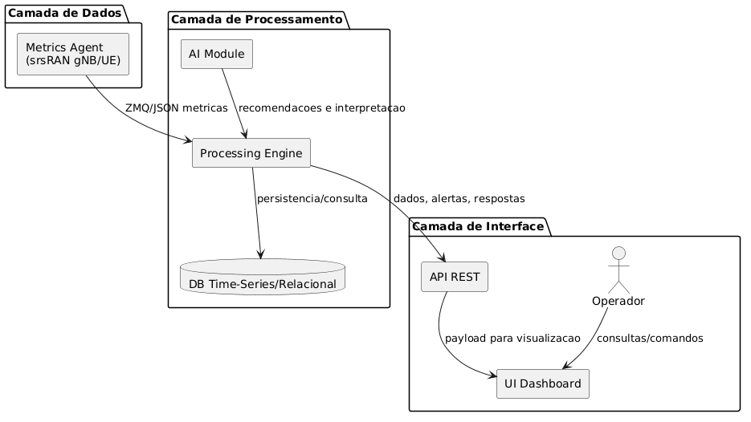
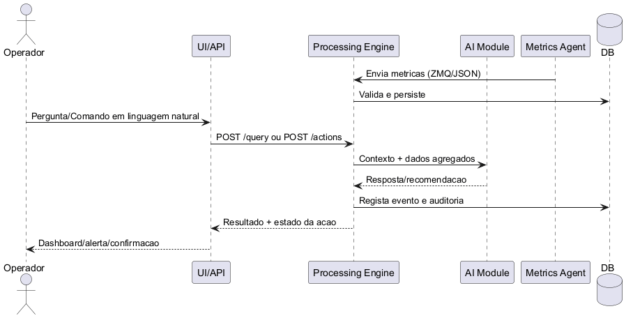

# Deliverable D1 - Desenho de Solucao

## 1. Casos de Uso

### Caso de Uso 1 - Consulta de Métricas

- Utilizador: Operador/Engenheiro de rede.
- Objetivo: Obter uma resposta em linguagem natural sobre o estado atual da rede com base nas metricas recolhidas.
- Pré-condição: O sistema de recolha de metricas do gNB/UE esta ativo.
- Fluxo principal:
	1. O operador envia uma pergunta (ex.: "qual a latência média da célula X nos últimos 5 minutos?").
	2. O módulo de processamento consulta as métricas relevantes.
	3. O módulo LLM interpreta a pergunta e sintetiza a resposta.
	4. A UI/API devolve a resposta ao operador.
- Resultado esperado: Resposta clara, contextualizada e com referência temporal.

### Caso de Uso 2 - Monitorização de Qualidade de Serviço (QoS)

- Utilizador: Operador de rede.
- Objetivo: Ser notificado automaticamente sobre degradação de QoS em células específicas.
- Pré-condicao: Limiares de alerta e regras de anomalia configurados.
- Fluxo principal:
	1. O sistema recolhe continuamente métricas (latência, throughput, BLER, PRB, etc.).
	2. O módulo de processamento aplica regras/algoritmos de deteção de anomalias.
	3. Quando uma condicao de alerta é detetada, um evento é gerado.
	4. A UI/API apresenta regista estes eventos.
- Resultado esperado: Deteção proativa de problemas e redução de tempo de resposta operacional.

### Caso de Uso 3 - Otimização de Recursos e Manipulação da Rede

- Utilizador: Operador (com apoio do Agente AI).
- Objetivo: Permitir instruções em linguagem natural para sugerir ou aplicar ajustes em parâmetros da rede.
- Pré-condição: Politicas de seguranca e níveis de permissão definidos.
- Fluxo principal:
	1. O operador envia uma instrução (ex.: "reduzir potência da célula X em 2 dB").
	2. O agente interpreta a instrução e mapeia para uma ação possível.
	3. O sistema executa a ação (ou apresenta sugestão para aprovação).
	4. A UI/API devolve confirmação e o resumo da alteração.
- Resultado esperado: Otimização mais rápida, com rastreabilidade e controlo humano.

## 2. Arquitetura do Sistema (Alto Nivel)

O sistema é organizado em três camadas: Dados, Processamento e Interface. A camada de Dados integra-se com srsRAN para recolher métricas de gNB e UE em tempo (quase) real e publica essas metricas via ZMQ. A camada de Processamento recebe, normaliza e agrega os dados, executa deteção de anomalias e permite a interpretação de comandos/ações com apoio do LLM.

A camada de Interface disponibiliza 'dashboards' permitindo uma melhor visualização, endpoints REST para integração externa e um canal de através do qual o utilizador poderá interagir em linguagem natural com o agente. Esta separação irá permitir escalabilidade (processamento desacoplado da captura), manutenção mais simples e evolução independente de cada componente.

**Diagrama de Componentes:**

## 3. Componentes Individuais (Resumo + Tecnologias)

O componente de Dados é responsável por recolher telemetria da RAN (gNB/UE), garantir formato consistente de eventos e encaminhar as mensagens para processamento com baixa latencia. O componente de Processamento é onde os dados serão armazenados e onde o modulo LLM irá transformar perguntas em consultas operacionais e gerar respostas/sugestões. Finalmente, o componente de UI irá exibir estes resultados e será através dele que o operador irá interagir com o sistema.

| Componente | Funcao Principal | Tecnologias Sugeridas |
| --- | --- | --- |
| **Dados** | Captura de metricas do gNB/UE, serializacao e publicacao de eventos | Python, srsRAN, ZMQ |
| **Processamento** | Ingestao, normalizacao, armazenamento, analitica, deteccao de anomalias, apoio LLM | Python, FastAPI (servico), SQLite/PostgreSQL/InfluxDB, LLM open-source (LLaMA/GPT4All), TensorFlow/PyTorch (opcional) |
| **Interface** | Dashboards, alertas, consulta via API e interacao com operador | React.js, Grafana, FastAPI/Flask |

## 4. Interação entre Componentes e Especificação de Interfaces

**Diagrama de Sequência:**

### 4.1 Fluxo de Interacao (alto nivel)

1. Metrics Agent envia eventos e métricas para o Processing Engine.
2. Processing Engine valida e armazena os dados.
3. AI Module consulta dados agregados e produz inferências/recomendações.
4. UI/API consulta o Processing Engine para mostrar métricas, alertas e respostas ao operador.
5. Operador pode enviar comandos; o Processing Engine valida e ativa ações no módulo de controlo da rede.

### 4.2 Interfaces entre Componentes

**Dados -> Processamento (ZMQ / JSON)**

- Métricas disponibilizadas:
	- `timestamp`
	- `cell_id`
	- `ue_id` (quando aplicável)
	- `latency_ms`, `throughput_mbps`, `prb_usage_pct`, `bler_pct`, `rsrp_dbm`
	- `event_type` (metric, alarm, state)
- Dados aceites pelo Processamento:
	- Mensagens JSON com schema versionado (`schema_version`).

**Processamento <-> AI Module (API interna)**

- Dados disponibilizados pelo Processamento:
	- Séries temporais agregadas por celula/UE.
	- Estado de alarmes e baseline histórico.
- Dados aceites pelo AI Module:
	- Interpretação de query do operador.
	- Recomendações de ajuste (`parameter`, `old_value`, `new_value`, `confidence`).

**Processamento -> UI/API (REST/JSON)**

- Endpoints sugeridos:
	- `GET /metrics?cell_id=&from=&to=`
	- `GET /alerts?status=open`
	- `POST /query` (pergunta em linguagem natural)
	- `POST /actions` (pedido de alteração de um parâmetro)
- Dados disponibilizados:
	- Métricas atuais e históricas, alertas, recomendações, estado de execução de ações.
